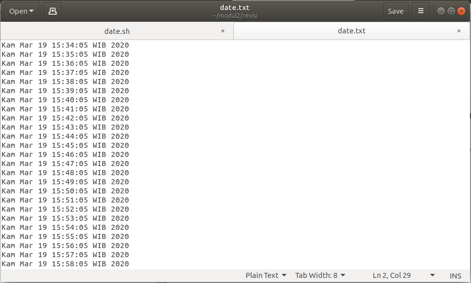

# SoalShiftSISOP20_modul2_C10
Praktikum Modul 2 Sistem Operasi 2020

### Nama Anggota Kelompok :
### 1. Devi Hainun Pasya (05111840000014)
### 2. Anggara Yuda Pratama (05111840000008)

### Daftar Soal
* [No. 1](https://github.com/notdevi/SoalShiftSISOP20_modul2_C10/#soal-no-1)
* [No. 2](https://github.com/notdevi/SoalShiftSISOP20_modul2_C10/#soal-no-2)
* [No. 3](https://github.com/notdevi/SoalShiftSISOP20_modul2_C10/#soal-no-3)

### Soal No. 1
Buatlah program C yang menyerupai crontab untuk menjalankan script bash, dengan ketentuan :

(a) Program menerima 4 argumen berupa :
    - Detik : 0-59 atau * (any value) 
    - Menit : 0-59 atau * (any value) 
    - Jam : 0-23 atau * (any value)
    - Path file .sh
    
(b) Program akan mengeluarkan pesan error jika argumen tidak sesuai.

(c) Program hanya menerima 1 configuration cron.

(d) Program berjalan di background (daemon).

(e) Tidak boleh menggunakan fungsi system().


***soal1.c***

[kodingan](https://github.com/notdevi/SoalShiftSISOP20_modul2_C10/blob/master/soal1/soal1.c)

**PENJELASAN :**

Kita harus cek apakah argumen berupa bintang/ * atau angka, untuk cek apakah argumen tersebut berupa bintang atau bukan dengan fungsi :
```c
int cek_bintang(char source[]) {
  if (source[0] == '*') return 1;

  return 0;
}
```

Sedangkan untuk cek apakah argumen berupa angka atau bukan dengan fungsi :
```c
int isDigit(char source[]) {
  for (int i = 0; i < strlen(source); i++)
    if (source[i] < '0' || source[i] > '9')
      return 0;

  return 1;
}
```

Masuk ke int main, kita harus cek apakah argumen yang dimasukkan sudah benar berjumlah 5 atau belum dengan `if(argc == 5)`, jika salah kita masuk ke 
```c
	else {
        	printf("argument is not valid!\n");
            	exit(EXIT_FAILURE);
    	}
```
yang berada di akhir program.

Lalu kita melakukan looping untuk cek apakah argumen detik, menit, jam berupa bintang atau angka atau bukan.
```c
for (x = 1; x < 4; x++) {
            if (isDigit(argv[x])) {
                argument[x] = atoi(argv[x]);
                if(argument[x] < 0)
                    printf("argument %d is not valid\n", x);
            }
            else if (cek_bintang(argv[x]))
                argument[x] = -1;
            else {
                printf("argument %d tidak sesuai dengan yang diminta\n", x);
                exit(EXIT_FAILURE);
            }
        }
```

Selanjutnya kita cek apakah waktu dari detik, menit, jam itu diluar range yang ditentukan atau tidak.
```cc
        int cek = atoi(argv[x]);
            //cek range detik dan menit
            if ((x == 0 || x ==1) && (cek > 59 || cek < 0)) {
                printf("Argumen Tidak Sesuai Range yang Diminta\n");
                return 0;
            }
            //cek range jam
            if (x == 2 && (cek > 23 || cek < 0 )){
                printf("Argumen Tidak Sesuai Range yang Diminta\n");
                return 0;
            }
```

Soal diminta untuk program berjalan di background, maka kami menggunakan template daemon seperti di modul 2.
```c
pid_t pid, sid;

        pid = fork();

        if (pid < 0)
            exit(EXIT_FAILURE);

        if (pid > 0) 
            exit(EXIT_SUCCESS);

        umask(0);

        sid = setsid();
        if (sid < 0)
            exit(EXIT_FAILURE);

        if ((chdir("/")) < 0) {
            exit(EXIT_FAILURE);
        }   
        
        close(STDIN_FILENO);
        close(STDOUT_FILENO);
        close(STDERR_FILENO);

        while(1){
            time_t waktu = time(NULL);              //struct bawaan c utk waktu sekarang
            struct tm *now_tm = localtime(&waktu);  //buat mengetahui waktu sekarang

            detik_skrng = now_tm->tm_sec;
            menit_skrng = now_tm->tm_min;
            jam_skrng = now_tm->tm_hour;

            if((detik_skrng == argument[1] || argument[1] == -1)
                && (menit_skrng == argument[2] || argument[2] == -1)
                    && (jam_skrng == argument[3] || argument[3] == -1)) {
                        pid_t child_id;
                        child_id = fork();

                        if (child_id < 0) {
                            printf("fail to fork");
                            exit(EXIT_FAILURE); // Jika gagal membuat proses baru, program akan berhenti
                        }

                        if (child_id == 0) {    
                            char *trm[] = {"bash", argv[4], NULL};
                            execv("/bin/bash", trm);
                        }
                    }
            sleep(1);    //delay selama 1 detik
        }  
    }
```

Di perulangan `while(1)` , kami menggunakan struct time.h untuk melakukan segala proses yang berkaitan dengan waktu. `fork(), wait(), exec()` digunakan supaya program bisa berjalan dan dapat dikill sehingga tidak menghabiskan memori. Daemon akan terus berjalan dengan jeda 1 detik (fungsi`sleep(1)`), hingga daemon diberhentikan.

**HASIL :**
program akan menjalankan sebuah perintah untuk menjalankan `date.sh` setiap detik ke 5


isi dari file dari `date.sh` sendiri yang nantinya akan membuat `date.txt`. 


Nanti di dalam date.txt tersebut akan update date setiap detik ke 5.


### Soal No. 2
Kiwa udh jago, jadi dia bikin program :

(a) Kiwa membuat folder, didalamnya terdapat program C yang per 30 detik membuat sebuah folder dengan nama timestamp `[YYYY-mm-dd_HH:ii:ss]`.

(b) Tiap folder diisi dengan 20 gambar yang didownload dari `https://picsum.photos/`, dimana tiap gambar berbentuk persegi dengan ukuran (t%1000)+100 pixel dimana t adalah detik Epoch Unix. Gambar diberi nama timestamp `[YYYY-mm-dd_HH:ii:ss]`.

(c) Setelah sebuah folder terisi 20 gambar, folder akan di `zip` dan folder akan di delete (sehingga hanya menyisakan `.zip`).

(d) Buat program "killer" yang siap di run (executable) untuk menterminasi semua operasi program tersebut. Setelah di run, program akan menterminasi program utama, lalu mendelete dirinya sendiri.

(e) Program utama bisa di run dalam dua mode, yaitu **MODE_A** dijalankan dengan argumen `-a` dan **MODE_B** dijalankan dengan argumen `-b`. Ketika dijalankan dalam **MODE_A**, program utama akan langsung menghentikan semua operasinya ketika program killer dijalankan. Untuk **MODE_B**, ketika program killer dijalankan, program utama akan berhenti tapi membiarkan proses di setiap folder yang masih berjalan sampai selesai (semua folder terisi gambar, terzip lalu di delete). 

***soal2.c***

[kodingan](https://github.com/notdevi/SoalShiftSISOP20_modul2_C10/blob/master/soal2/soal2.c)

**PENJELASAN :**

Pertama, dibuat sebuah fungsi `times` yang berfungsi untuk mengambil local time untuk penamaan direktori dan zip. Pengambilan local time menggunakan fungsi `sprintf` yang menyimpan string localtime dalam variable `filename` dan return value berupa variable `filename`.
```c
char *times(){
	int jam, menit, detik, hari, bulan, tahun;
  	time_t rawtime = time(NULL);
  	struct tm tm = *localtime(&rawtime);

  	jam = tm.tm_hour;
  	menit = tm.tm_min;
  	detik = tm.tm_sec;
  	hari = tm.tm_mday;
  	bulan = tm.tm_mon+1;
  	tahun = tm.tm_year+1900;

  	sprintf(filename, "%02d-%02d-%d_%02d:%02d:%02d",
          	hari, bulan, tahun, jam, menit, detik);

  return filename;
}
```
Karena program dapat dijalankan dalam 2 mode, maka dibuat percabangan `if` yang mengecak argumen yang diiinputkan. 

Apabila dimasukkan -a, proses yang dijalankan soal2 akan langsung di hentikan total, dengan memasukkan command `#!/bin/bash\nkillall soal2` pada file `soal2_killer.sh` yang dibuat. 

Kemudian setelah command dijalankan, file soal2_killer akan dihapus dengan `rm $0`.
```c
if(strcmp(argv[1], "-a") == 0) {
	fprintf(killer, "#!/bin/bash\nkillall revisisoal2\n");
	fprintf(killer, "rm $0");
}
```
Apabila dimasukkan -b, parent process dijalankan soal2 akan di hentikan, dengan menjalankan command `#!/bin/bash\nkill %d` dimana `%d` adalah pid yang didapatkan dari fungsi `getpid()` pada file `soal2_killer.sh` yang dibuat. 

Kemudian setelah command dijalankan, file soal2_killer akan dihapus dengan `rm $0`.
```c
else if(strcmp(argv[1], "-b") == 0) {
	fprintf(killer, "#!/bin/bash\nkill %d\n", getpid());
	fprintf(killer, "rm $0");
}
```
Apabila input yang dimasukkan tidak sesuai, maka akan muncul message error.
```c
else {
	printf("maaf tidak bisa dikabulkan, gunakan -a atau -b\n");
	exit(0);
}
```
Karena process berjalan pada background, maka digunakan template daemon process
```c
	pid_t pid, sid, child_1, child_2, child_3, child_4;

	pid = fork();

	if(pid < 0) {
		exit(EXIT_FAILURE);
	} 
	if(pid > 0) {
		exit(EXIT_SUCCESS);
	}
	
	umask(0);

	sid = setsid();
	if(sid < 0) {
		exit(EXIT_FAILURE);
	} 
	if((chdir("/home/devi/")) < 0) {
		exit(EXIT_FAILURE);
	}

  	close(STDIN_FILENO);
  	close(STDOUT_FILENO);
  	close(STDERR_FILENO);

	while(1) {
	...
	}
```
Proses pertama yang dijalankan dalam while adalah untuk membuat direktori yang diberi nama sesuai timestamp.
Pertama fungsi `times()` dipanggil, lalu dicoppy ke variable `folder`, kemudian isinya akan digabung dengan variable `dirname` yang berisi direktori `"/home/devi/"`.
```c
	strcpy(folder, times());
	strcat(dirname, folder);
```
Anak dari fork pertama digunakan untuk mengeksekusi pembuatan folder menggunakan command `mkdir` yang dipanggil menggunakan `execv`.
```c
	if(child_1 == 0) {
		char *makedir[] = {"mkdir", "-p", dirname, NULL};
		execv("/bin/mkdir", makedir);
	}
```
Karena ukuran foto yang diminta berukuran `(t%1000)+100` maka dijalankan :
```c
	unsigned long epoch = time(NULL), 
		      size = (epoch%1000)+100;
	sprintf(picsize, "%lu", (epoch%1000)+100);
```
Kemudian anak dari fork kedua mengeksekusi proses download gambar. Gambar diunduh sebanyak 20 kali per folder, maka digunakan perulangan `for(int i = 1; i <= 20; i++)`. 

Hasil dari penghitungan ukuran foro yang disimpan pada variable `picsize` kemudian di gabung dengan URL pengunduhan gambar dengan menggunakan `strcat(url, picsize);`.

Proses download dieksekusi dengan command `wget` yang dipanggil menggunakan `execv`.
```c
	if(child_2 == 0) {
		for(int i = 1; i <= 20; i++) {
			unsigned long epoch = time(NULL), 
		                      size = (epoch%1000)+100;
			sprintf(picsize, "%lu", (epoch%1000)+100);

			char url[100] = "https://picsum.photos/";
			strcat(url, picsize);

			strcpy(fordir, dirname);
			strcat(fordir, "/");
			strcat(fordir, times());
			
			child_3 = fork();
			if(child_3 == 0) {
				char *donlot[] = {"wget", url, "-O", fordir, NULL};
				execv("/usr/bin/wget", donlot);
			}
			sleep(5);
		}
```
Setelah terdownload 20 gambar, folder akan di `zip` lalu dihapus. Untuk penamaan dari file `zip`, string dari variable `folder` yang sudah berisi timestamp di copy ke variable `zipname`, kemudian ditambahkan `.zip`.
```c
	strcpy(zipname, folder);
	strcat(zipname, ".zip");
```
Anak dari fork ke empat mengeksesuki proses zipping dan menghapus folder setelah di zip. Proses zip dan remove dieksekusi dengan command `zip` dan `-rm` yang dipanggil menggunakan `execv`.
```c
	child_4 = fork();
	if(child_4 == 0) {
		char *rmv[] = {"zip", "-rm", zipname, folder, NULL};
		execv("/usr/bin/zip", rmv);
	}
```
setiap membuat folder diberi jeda 30 detik maka diberi `sleep(30);`.

**HASIL :**

program utama dan killer berjalan.


direktori dan zip terbuat.


isi file zip.


### Soal No. 3
Beberapa tugas harus dikerjakan secara bersamaan :

(a) Program harus mmebuat dua direktori di **"home/[USER]/modul2/"**. Direktori pertama diberi nama **"indomie"**, kemudian 5 detik kemudian membuat direktori kedua bernama **"sedaap"**.

(b) Program harus meng-ekstrak file **jpg.zip** di direktori **"home/[USER]/modul2/"**.

(c) Setelah di ekstrak, hasil pada direktori **"home/[USER]/modul2/jpg/"** herus dipindahkan dengan pengelompokkan. File dipindahkan ke **"home/[USER]/modul2/sedaap/"** sedangkan direktori dipindahkan ke **"home/[USER]/modul2/indomie/"**.

(d) untuk setiap direktori yang dipindahkan ke **"home/[USER]/modul2/indomie"** harus membuat dua file kosong. File pertama diberi nama **coba1.txt**, 3 detik kemudian membuat file bernama **coba2.txt**.

***soal3.c***

[kodingan](https://github.com/notdevi/SoalShiftSISOP20_modul2_C10/blob/master/soal3/soal3.c)

**PENJELASAN :**

`fork()` pertama digunakan untuk melahirkan anak yang akan mengeksekusi perintah untuk membuat direktori bernama **'indomie'** pada folder modul 2. Parent akan melahirkan anak lain pada scope yang berbeda. Karena fungsi `mkdir()` tidak boleh digunakan, maka digunakan fungsi `exec`. fungsi `mkdir` dipanggil melalui `execv`. 

```c
child_1 = fork();
	if (child_1 < 0) {
		exit(EXIT_FAILURE);
	}
	
	if (child_1 == 0) {
	// child 1
		char *argv[] = {"mkdir", "-p", "/home/devi/modul2/indomie", NULL};
		execv("/bin/mkdir", argv);
  }
```
`fork()` kedua digunakan untuk melahirkan anak yang akan mengeksekusi perintah untuk membuat direktori bernama **'sedaap'** pada folder modul 2. Parent akan melahirkan anak lain pada scope yang berbeda. Karena fungsi `mkdir()` tidak boleh digunakan, maka digunakan fungsi `exec`. fungsi `mkdir` dipanggil melalui `execv`. 
untuk melakukan penjedaan selama 5 detik sebelum pembuatan folder **'sedaap'**, digunakan fungsi `sleep(5)`.
```c
child_1 = fork();
		if (child_1 == 0) {
		// child 2
			sleep(5);
			char *argv[] = {"mkdir", "-p", "/home/devi/modul2/sedaap", NULL};
			execv("/bin/mkdir", argv);
		} 
```
`fork()` kedua digunakan untuk melahirkan anak yang akan mengeksekusi perintah untuk mengekstrak file `zip` bernama **'jpg.zip'** pada folder modul 2. Parent akan melahirkan anak lain pada scope yang berbeda. Fungsi `unzip` dipanggil melalui `execv`. 
```c
		int status2;
		child_1 = fork();
		if (child_1 == 0) {
		// child 3
			//while (wait(&status) > 0);
			chdir("/home/devi/modul2");
			char *zip[] = {"unzip", "/home/devi/modul2/jpg.zip", NULL};
			execv("/usr/bin/unzip", zip);
		}
```
Perlu juga mendeclare `int status2;`, karena pengeksekusian dari parent process harus menunggu child process selesai terlebih dahulu. Dalam hal ini, untuk menyortir file, harus menunggu proses `unzip` selesai terlebih dahulu.

Kemudian parent process untuk menyortir file akan dieksekusi. 

Fungsi `while ((wait(&status2)) > 0);` dipanggil untuk menunggu child process. 
Proses penyortiran file dilakukan dengan pertama-tama membuka direktori jpg yang merupakan hasil ekstrak dari `zip`. Kemudian dilakukan pengecekkan, apabila isi direktori tersebut kosong, maka `return 0`.
```c
		while ((wait(&status2)) > 0);
		struct dirent *drct;
		DIR *dir = opendir("/home/devi/modul2/jpg");

		if (dir == NULL) {	
			return 0;
		}
```
Apabila direktori tidak kosong, maka proses sortir akan dijalankan.
Pertama buat array `path[100]` yang digunakan untuk menampung path dari masing-masing file/direktori yang berada dalam folder jpg.
Kemudian buat `struct` yang menyimpan tipe file. Karena direktori "." dan ".." tidak termasuk, maka perlu dilakukan pengecekkan direktori dengan menggunakan fungsi `strcmp`, apabila perbedaannya = 0, maka `continue`, direkrori tidak ikut di sortir. 
```c
	while ((drct = readdir(dir)) != NULL) {
		char path[100];		
		struct stat filetype;
		if (strcmp(drct->d_name, ".") == 0 || strcmp(drct->d_name, "..") == 0) {		
			continue;
		} 
```
Kemudian path dari masing-masing file/direktori dimasukkan ke array `path` dengan mengcopy (`strcpy`) path folder jpg, lalu ditambahkan dengan direktori/file name menggunakan `strcat`.
```c
          else {
		strcpy(path, "/home/devi/modul2/jpg/");
		strcat(path, drct->d_name);
```
Lalu dilakukan proses pengecekkan dengan menggunakan `filetype.st_mode & S_IFDIR`, apabila type file merupakan direktori, akan di move ke direktori **'indomie'**. Pemindahan menggunakan command `mv` yang dipanggil dengan `execv`.  
```c
	if (stat(path, &filetype) == 0) {
		if (filetype.st_mode & S_IFDIR) {
			if (child_1 = fork() == 0) {
				char *move1[] = {"mv", path, "/home/devi/modul2/indomie/", NULL};
				execv("/bin/mv", move1);
			}
```
Setelah semua direktori di dalam folder jpg masuk ke direktori indomie, maka sisanya akan dimasukkan ke direktori **'sedaap'**. Karena diawal kita membuka direktori jpg, maka sekarang ditutup dengan fungsi `closedir`.
```c
		} else {
			if (child_1 = fork() == 0) {
				char *move2[] = {"mv", path, "/home/devi/modul2/sedaap/", NULL};
					execv("/bin/mv", move2);
				} 
			}
		}
	}
}
closedir(dir); 
```
Untuk membuat file `coba1.txt` dan `coba2.txt` kurang lebih sama dengan proses sortir file. Pertama open direktori indomie, karena direktori yang akan diisi berada didalamnya. Kemudian lakukan komparasi untuk meng-exclude direktori "." dan "..".
```c
struct dirent *makefile;
DIR *file = opendir("/home/devi/modul2/indomie");
		
while ((makefile = readdir(file)) != NULL) {
	char location[100];
	if (strcmp(makefile->d_name, ".") == 0 || strcmp(makefile->d_name, "..") == 0) {		
		continue;
	} 
```
kemudian path dari masing-masing direktori didalam folder indomie dimasukkan ke array `location`.
```c
          else {
		strcpy(location, "/home/devi/modul2/indomie/");
		strcat(location, makefile->d_name);
```
Kemudian dilakukan pemindahan direktori ke direktori yang akan diisi file `.txt` dengan menggunakan fungsi `chdir`. Setelah itu dijalankan command untuk membuat file `coba1.txt` yaitu `touch` yang dipanggil melalui `execv`. Karena pembuatan file antara coba1 dan coba2 perlu dijeda, maka digunakan fungsi `sleep(3);`. Lalu buat file `coba2.txt` dengan cara yang sama. 
```c
						if (child_1 = fork() > 0) {
							chdir(location);
							char *mktxt1[] = {"touch", "coba1.txt", NULL};
							execv("/bin/touch", mktxt1);
						} sleep(3);
						if (child_1 = fork() > 0) {
							chdir(location);
							char *mktxt2[] = {"touch", "coba2.txt", NULL};
							execv("/bin/touch", mktxt2);
						}
					}
				}
				closedir(file);					
```
Kemudian tutup directory dengan fungsi `closedir`.

**HASIL :**

program berhasil membuat folder indomie dan sedaap, serta mengekstrak file zip.


direktori berhasil dipindahkan ke folder indomie.


file berhasil dipindahkan ke folder sedaap.


file coba1.txt dan coba2.txt berhasil dibuat.


